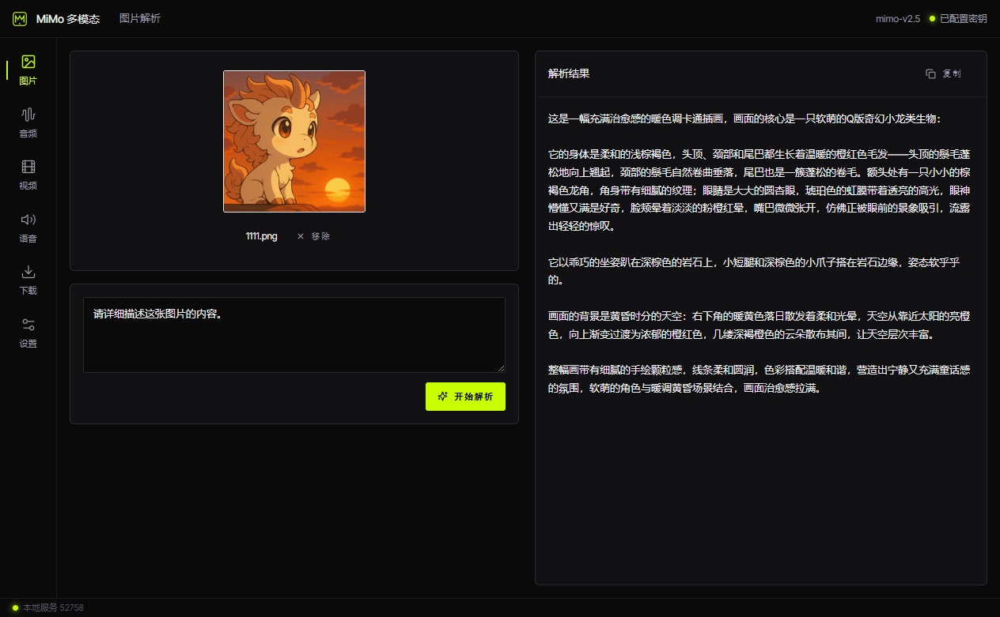
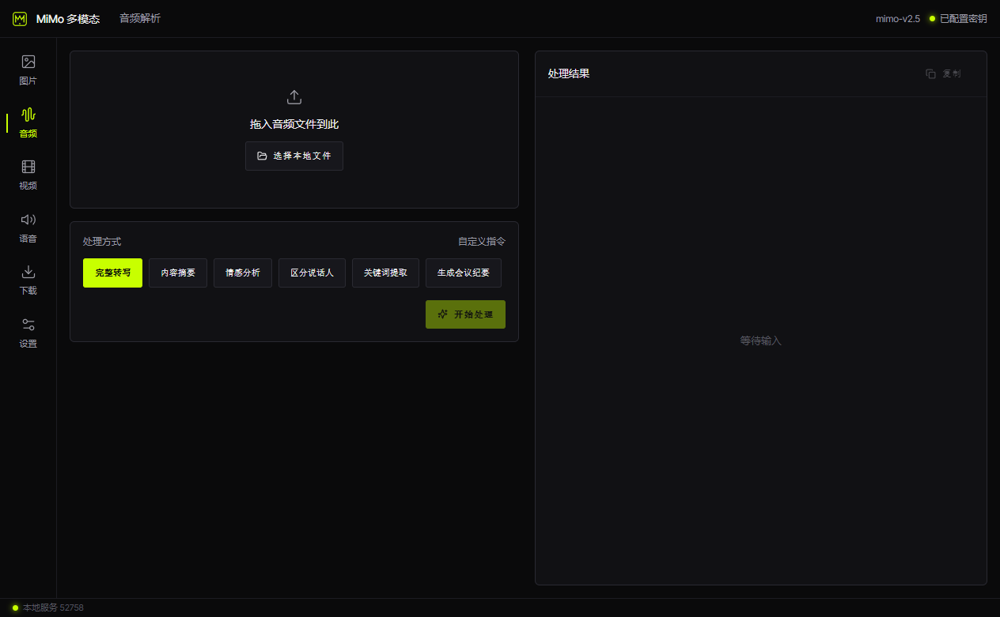
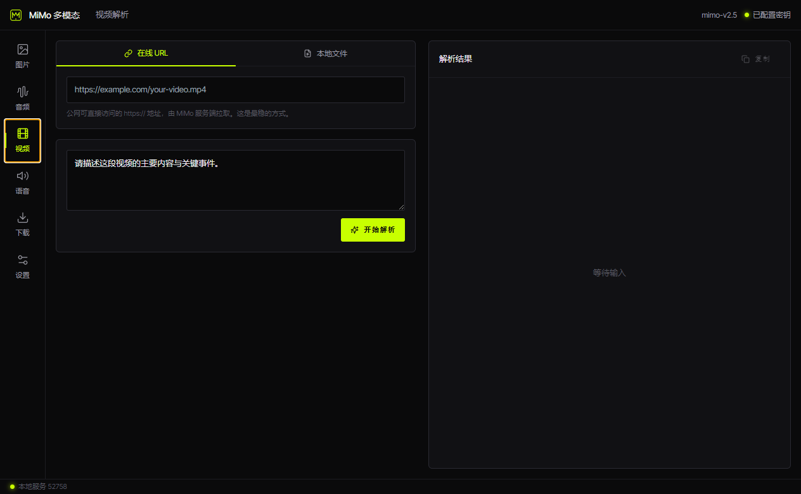
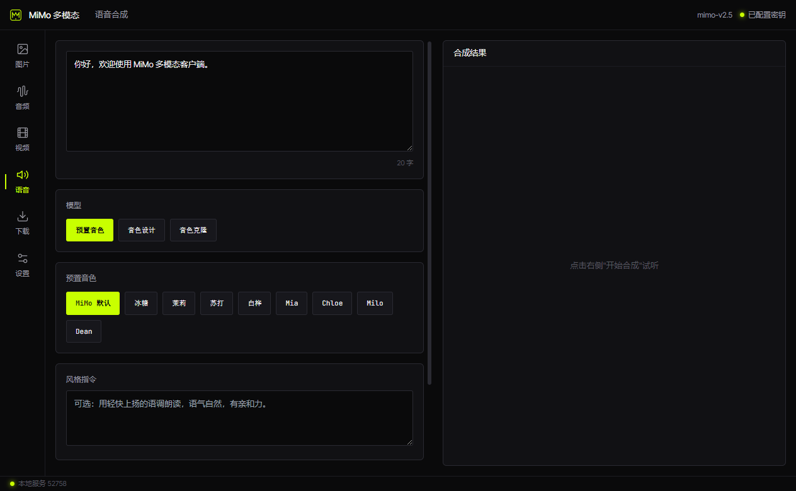
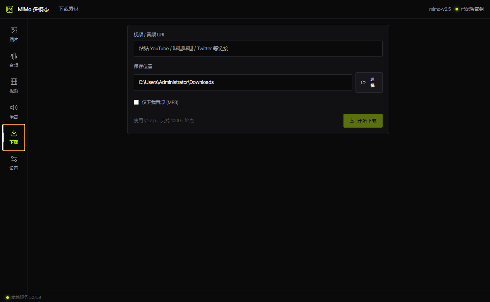
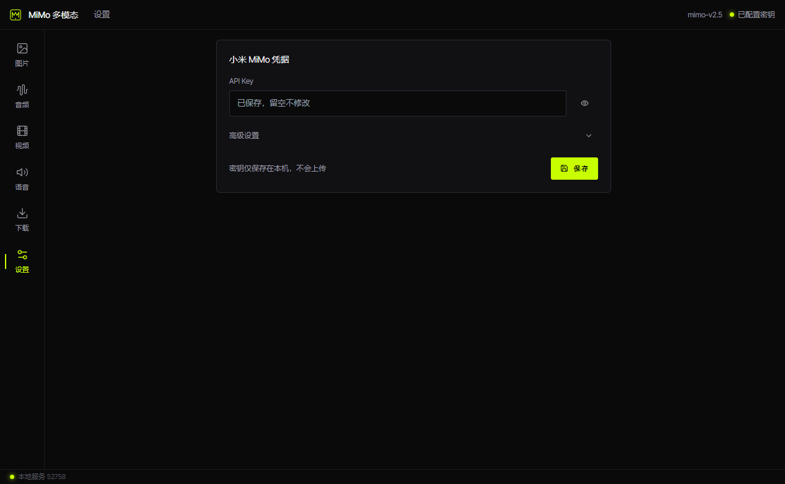

# MiMo Lab

一个由小米 MiMo 驱动，面向图像、音频、视频分析和文本转语音工作流的跨平台多模态 AI 桌面客户端。

[English](./README.md) | [简体中文](./README.zh-CN.md)

## 页面展示








## 主要功能

- 使用小米 MiMo 多模态模型分析图像、音频和视频
- 按音色、格式与语速生成语音
- 避免将 API 凭据打包进渲染进程资源
- 在动态选择的本机回环端口运行 FastAPI sidecar
- 将 Python sidecar 打包进 Windows 与 macOS 安装包
- 通过 GitHub 发布版本并为应用提供更新

## 架构

```text
React 渲染进程
  ↕ Electron preload IPC
Electron 主进程
  ↕ localhost FastAPI
Python sidecar
  ↕ MiMo 兼容 API
```

## 技术栈

Electron · React · TypeScript · Vite · Tailwind CSS · Python · FastAPI · PyInstaller · electron-builder

## 快速开始

### 安装依赖

```bash
npm install
python -m venv .venv
source .venv/bin/activate  # macOS/Linux
# .venv\Scripts\activate # Windows
pip install -r sidecar/requirements.txt
```

### 配置 API Key

可以复制 `.env.example` 为 `.env` 并填写 `MIMO_API_KEY`，也可以在应用设置页保存密钥。不要提交真实凭据。

### 启动开发

```bash
npm run dev
```

## 构建

打包 Electron 前，先为目标操作系统构建 sidecar：

```bash
npm run sidecar:build:mac
npm run pack:mac

# Windows
npm run sidecar:build:win
npm run pack:win
```

## 安全说明

- API Key 由主进程和本地 sidecar 处理，不会进入渲染进程 bundle。
- sidecar 仅绑定 `127.0.0.1`，端口在运行时动态选择。
- 应用内保存的凭据位于用户数据目录，并在支持的平台上限制文件权限。

## 许可证

MIT
